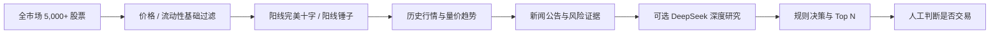

<div align="center">

# Personal Quant Trading Agent

### 面向 A 股尾盘决策的个人量化研究智能体

让 Python 浏览全市场，让 AI 只研究真正值得关注的候选股。

[](https://github.com/YishiQiu/personal-quant-trading-agent/actions/workflows/ci.yml)
[](https://www.python.org/)
[](https://fastapi.tiangolo.com/)
[](https://react.dev/)
[](LICENSE)

**确定性筛选 · 严格 K 线定义 · 候选股深度研究 · 人工最终决策**

</div>


## 它解决什么问题

这不是自动交易机器人，也不会替你下单。它的目标是把每天数小时的市场研究压缩成一条可审计的研究链路：先浏览 5,000+ 只 A 股，再用明确、可配置的 Python 规则识别阳线完美十字和阳线锤子，最后只对命中股票补充历史行情、新闻公告、风险指标与可选的 DeepSeek 研究。



核心边界很简单：**规则负责扫描，模型负责研究，人负责决策。** 大模型不会遍历整个市场，也不能绕过风险规则。

## 已实现能力

| 模块 | 当前能力 |
| --- | --- |
| 全市场扫描 | 新浪免费源、东方财富免费源与可替换 Provider；完整性校验、重试与本地快照 |
| 基础漏斗 | 排除 ST / 退市、价格 3–100 元、成交额和涨跌幅阈值均可配置 |
| 形态识别 | 纯数学计算，不使用图片识别；只保留阳线完美十字与阳线锤子 |
| 深度研究 | 对全部形态命中股加载历史日 K、均线趋势、量能、新闻公告与风险证据 |
| 新闻证据 | 巨潮资讯公告、东方财富个股新闻；可选 Tushare 补充来源 |
| 模型研究 | 可选 DeepSeek JSON 研究结论；密钥只存在后端环境变量中 |
| 决策输出 | 多因子加权、风险提示、Top N 推荐、SQLite 留档与 Markdown 报告 |
| 研究界面 | React + TypeScript 浅色工作台，展示扫描规模、命中结果与研究详情 |

当前工作流以同步、可测试的模块编排为主，已经预留 Agent 接口和 LangGraph 可选依赖；后续可以在不改动数据 Provider 与领域模型的前提下替换编排层。

## 形态是怎样计算的

设开盘、最高、最低、收盘分别为 `O / H / L / C`，总振幅为 `R = H - L`。两类形态都要求 `C > O`，并且 `R / O >= 3%`。

| 形态 | 默认严格条件 |
| --- | --- |
| 阳线完美十字 | 实体 `|C-O| / R <= 2%`；上下影各占 `R` 至少 45%；上下影差不超过 `R` 的 6% |
| 阳线锤子 | 实体占 `R` 的 3%–30%；下影至少为实体 2 倍且占 `R` 至少 60%；上影不超过实体 0.5 倍 |

因此 T 字线不会被误认为锤子线，影线明显不对称的十字也不会进入“完美十字”。所有门槛都在 [`configs/workflow.yaml`](configs/workflow.yaml) 中，可通过测试验证后再调整。

## 快速开始

需要 Python 3.11+ 与 Node.js 20+。

```bash
git clone https://github.com/YishiQiu/personal-quant-trading-agent.git
cd personal-quant-trading-agent

python3 -m venv .venv
source .venv/bin/activate
pip install -e '.[dev,api,data]'
cp .env.example .env

uvicorn 'trading_agent.api:create_app' --factory --reload
```

另开一个终端启动前端：

```bash
cd frontend
npm ci
npm run dev
```

打开 [http://localhost:5173](http://localhost:5173)，API 文档位于 [http://localhost:8000/docs](http://localhost:8000/docs)。如果只想验证工作流，无需任何 API Key：

```bash
trading-agent research --provider demo
pytest
```

### 使用最近完整收盘快照

公开免费源不保证盘中实时性。当前更稳妥的方式是在收盘后保存一份完整日 K，下一次研究自动使用最近有效快照：

```bash
trading-agent capture-close --provider sina_free
trading-agent research --provider sina_free
```

只有在 09:15 前或 15:00 后取得的完整数据才会写入正式收盘快照；盘中数据不会覆盖它。也可以指定快照文件重复回放：

```bash
trading-agent research \
  --provider sina_free \
  --snapshot data/raw_snapshots/sina-YYYYMMDDTHHMMSS+0800.json
```

### 启用 DeepSeek（可选）

在本地 `.env` 中填写：

```dotenv
DEEPSEEK_API_KEY=your_key_here
```

模型只会研究形态命中股。默认模型、超时与开关位于 [`configs/llm.yaml`](configs/llm.yaml)。`.env`、原始行情、新闻缓存和数据库都已被 Git 忽略。

## 数据来源与边界

| 数据 | 默认来源 | 说明 |
| --- | --- | --- |
| 全市场行情 | 新浪免费源 / 东方财富免费源 | 低频研究与回放；无稳定性和商用 SLA |
| 历史日 K | 新浪 / 东方财富 | 仅在形态筛选后逐股加载 |
| 公司公告 | 巨潮资讯 CNINFO | 保留公告时间、标题与原文链接 |
| 个股新闻 | 东方财富（AKShare 适配） | 失败时标记证据缺失，不伪造内容 |
| 补充新闻 | Tushare（可选） | 取决于账号接口权限 |
| LLM | DeepSeek（可选） | 读取已归因证据，不自行联网搜索 |

免费网页接口可能限流、改版或断连，系统会显式失败或降级，不把不完整数据伪装成完整市场。生产和商业用途应替换为有授权、有服务等级的数据源。详细字段要求见 [`docs/data-requirements.md`](docs/data-requirements.md)。

## 项目结构

```text
TradingAgent/
├── configs/                 # 扫描、形态、新闻与模型配置
├── docs/                    # 架构、工作流和数据接入文档
├── frontend/                # React + TypeScript 研究工作台
├── src/trading_agent/
│   ├── agents/              # 趋势、量能、催化、风险、LLM、决策 Agent
│   ├── data/                # 可插拔行情 Provider 与快照机制
│   ├── news/                # 新闻和公告 Provider
│   ├── services/            # 扫描、研究与调度服务
│   ├── api.py               # FastAPI 接口
│   └── cli.py               # 命令行入口
└── tests/                   # 单元测试与工作流测试
```

进一步阅读：[`架构说明`](docs/architecture.md) · [`工作流说明`](docs/workflow.md) · [`数据接入清单`](docs/data-requirements.md)

## 路线图

- [x] 全市场快照、基础过滤和严格形态门控
- [x] 候选股历史行情、新闻公告、风险与可选模型研究
- [x] FastAPI、React 工作台、SQLite 记录和测试
- [ ] 板块强度、资金流与基本面生产级数据源
- [ ] 推荐次日表现归因与个人评分权重学习
- [ ] LangGraph 持久化编排、回测与策略版本管理
- [ ] PostgreSQL、通知渠道、桌面端与多模型适配

## 参与贡献

欢迎提交数据 Provider、形态测试、界面优化和文档改进。开始前请阅读 [`CONTRIBUTING.md`](CONTRIBUTING.md)。安全问题请按 [`SECURITY.md`](SECURITY.md) 私下报告。

## 风险声明

本项目仅用于个人研究、工程实践和教育交流，不构成投资建议、收益承诺或自动交易服务。免费数据可能延迟、缺失或错误；任何交易决定及其损失均由使用者自行承担。

## License

基于 [MIT License](LICENSE) 开源。
