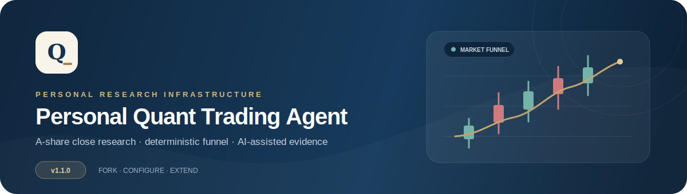
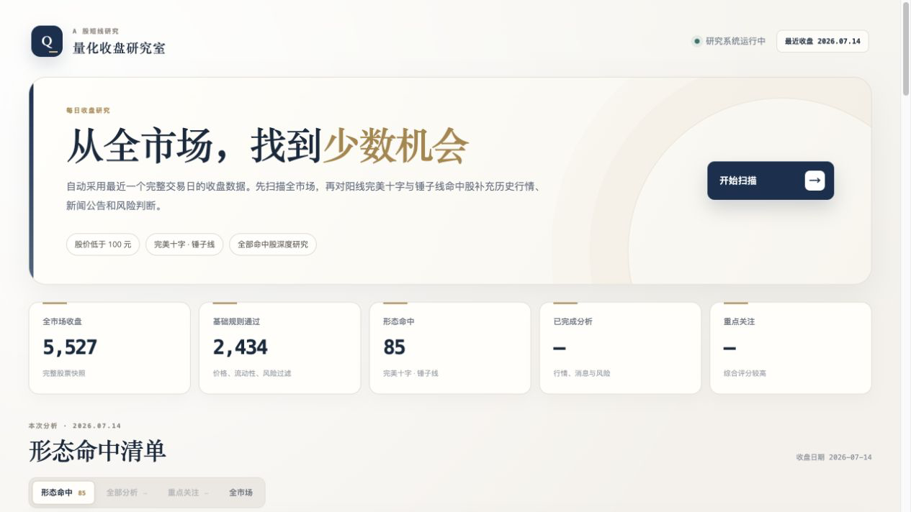

<div align="center">
  

  <p>
    <a href="https://github.com/YishiQiu/personal-quant-trading-agent/actions/workflows/ci.yml"></a>
    <a href="https://www.python.org/"></a>
    <a href="https://react.dev/"></a>
    <a href="LICENSE"></a>
  </p>

  <h3>面向 A 股尾盘决策的个人量化研究智能体</h3>
  <p>扫描全市场，筛选关键 K 线形态，补充历史行情与新闻证据，最终由人完成交易决策。</p>

  <p>
    <a href="#快速开始">快速开始</a> ·
    <a href="#如何使用">如何使用</a> ·
    <a href="#筛选逻辑">筛选逻辑</a> ·
    <a href="#配置说明">配置说明</a> ·
    <a href="docs/customization.md">复刻与改版</a>
  </p>
</div>

## 项目简介

Personal Quant Trading Agent 是一套围绕个人交易习惯设计的 A 股短线研究工具。它每天读取最近一个完整交易日的全市场收盘数据，先用确定性规则缩小股票范围，再对形态命中股补充历史行情、量价趋势、新闻公告、风险信息和可选的大模型研究。

它不是自动交易机器人，不连接券商下单，也不承诺收益。系统负责完成重复、耗时的市场研究工作，是否买入始终由使用者决定。

> **规则负责筛选，AI 负责研究，人负责决策。**<br/>
> 大模型不会扫描 5,000 多只股票，也不能绕过形态规则和风险判断。



### 目前可以做什么

- 浏览完整 A 股收盘快照，并查看每只股票是否通过基础条件。
- 自定义价格区间，以及是否纳入创业板、科创板。
- 用 OHLC 数学计算识别阳线完美十字和阳线锤子线。
- 对全部形态命中股加载历史 K 线，分析均线、趋势和成交量。
- 收集巨潮公告、东方财富新闻及可选 Tushare 新闻证据。
- 使用可选 DeepSeek 模型复核候选股，但最终评分仍由确定性规则完成。
- 展示每只候选股的理由、风险、新闻来源和综合评分。

## 工作流程

系统采用两阶段漏斗，避免无意义地对全市场逐股调用历史接口或大模型。

1. **读取全市场快照**：获取最近一个完整收盘日的全部 A 股行情。
2. **基础条件筛选**：按价格、板块、流动性、ST 和退市风险过滤。
3. **K 线形态筛选**：只保留阳线完美十字和阳线锤子线。
4. **逐股深度研究**：加载历史 K 线、成交量、趋势、新闻公告和风险数据。
5. **综合评分**：结合规则结果与可选模型意见，生成全部分析结果和重点关注列表。
6. **人工判断**：使用者根据证据决定是否尾盘介入，系统不会自动下单。

```text
A 股全市场
    ↓
价格 / 板块 / 流动性规则
    ↓
阳线完美十字 / 阳线锤子
    ↓
历史行情 / 量价趋势 / 新闻公告 / 风险
    ↓
可选 DeepSeek 研究
    ↓
综合评分与人工决策
```

## 快速开始

### 环境要求

- Python 3.11+
- Node.js 20+
- macOS、Linux 或 Windows WSL

### 1. 安装后端

```bash
git clone https://github.com/YishiQiu/personal-quant-trading-agent.git
cd personal-quant-trading-agent

python3 -m venv .venv
source .venv/bin/activate
pip install -e '.[dev,api,data]'
cp .env.example .env
```

启动 API：

```bash
uvicorn 'trading_agent.api:create_app' --factory --reload
```

后端启动后可以访问 [http://localhost:8000/docs](http://localhost:8000/docs) 查看接口文档。

### 2. 启动前端

另开一个终端：

```bash
cd frontend
npm ci
npm run dev
```

打开 [http://localhost:5173](http://localhost:5173) 进入研究工作台。

### 3. 可选：启用 DeepSeek

在本地 `.env` 中填写：

```dotenv
DEEPSEEK_API_KEY=your_key_here
```

不配置密钥也可以运行完整的规则筛选和确定性研究流程。密钥只由后端读取，不会发送到浏览器。

## 如何使用

1. 在首页设置最低价和最高价。
2. 选择是否纳入创业板和科创板。
3. 点击 **开始扫描**，系统会读取最近一个完整收盘快照。
4. 在 **形态命中** 中查看全部阳线完美十字和锤子线结果。
5. 点击 **分析全部股票**，补充历史行情、新闻公告和风险判断。
6. 在 **全部分析** 中逐只查看证据，在 **重点关注** 中查看综合评分较高的候选股。
7. 需要核对第一层筛选时，可进入 **全市场** 查看股票状态和具体排除原因。

### 使用最近完整收盘数据

免费公开源不保证盘中实时性，因此当前版本默认使用最近一个完整收盘日，而不是把未收盘的临时 K 线当作正式日线。

```bash
trading-agent capture-close --provider sina_free
trading-agent research --provider sina_free
```

系统只会在 09:15 前或 15:00 后把行情写入正式收盘快照。公开数据源失败时会保留上一次完整结果，不会用缺页数据生成推荐。

## 筛选逻辑

### 第一层：基础条件

默认筛选 3–100 元股票，并检查成交额、涨跌幅、ST 和退市风险。价格和板块范围可以直接在前端修改，其余参数位于 [`configs/market_scanner.yaml`](configs/market_scanner.yaml)。

### 第二层：K 线形态

全部使用 OHLC 数学计算，不使用图片识别。设总振幅 `R = H - L`，两种形态都要求 `C > O` 且 `R / O >= 3%`。

| 形态 | 默认定义 |
| --- | --- |
| 阳线完美十字 | `实体 / R ≤ 2%`；上下影各占 `R ≥ 45%`；影线差 `≤ 6%` |
| 阳线锤子 | 实体占 `R` 的 `3%–30%`；下影至少为实体 `2 倍` 且占 `R ≥ 60%`；上影不超过实体 `0.5 倍` |

T 字线和明显不对称的十字会被排除。所有阈值集中在 [`configs/workflow.yaml`](configs/workflow.yaml)，可以按自己的交易风格调整。

## 数据与模型

| 类别 | 当前来源 | 使用方式 |
| --- | --- | --- |
| 全市场行情 / 日 K | 新浪、东方财富 | 基础扫描与候选股历史行情 |
| 公司公告 | 巨潮资讯 CNINFO | 只查询已经入围的候选股 |
| 个股新闻 | 东方财富 / AKShare | 只查询已经入围的候选股 |
| 补充新闻 | Tushare，可选 | 取决于账号接口权限 |
| 研究模型 | DeepSeek，可选 | 只读取规则筛选后的候选股 |

> [!WARNING]
> 免费网页接口可能限流、改版、延迟或缺失。项目适合个人低频研究与工程实践；生产或商业用途应替换为有授权和服务保障的数据源。

## 配置说明

| 文件 | 用途 |
| --- | --- |
| [`configs/market_scanner.yaml`](configs/market_scanner.yaml) | 价格、成交额、涨跌幅、板块范围与基础股票池 |
| [`configs/workflow.yaml`](configs/workflow.yaml) | 十字、锤子线、风险阈值与最终关注数量 |
| [`configs/news.yaml`](configs/news.yaml) | 巨潮、东方财富和 Tushare 新闻源 |
| [`configs/llm.yaml`](configs/llm.yaml) | 模型服务、模型名称、超时和输出长度 |
| [`frontend/src/branding.ts`](frontend/src/branding.ts) | 页面名称、标记与首屏文案 |

修改配置后无需重写 Agent。形态阈值变化建议使用固定收盘快照对比结果，并同步补充测试。

## 工程结构

<details>
<summary><strong>查看项目目录</strong></summary>

```text
TradingAgent/
├── configs/                    # 扫描、形态、新闻与模型配置
├── docs/                       # 架构、工作流与数据接入说明
├── frontend/                   # React + TypeScript 研究工作台
├── src/trading_agent/
│   ├── providers/              # 可插拔行情数据源
│   ├── market_scanner/         # 基础漏斗与形态门控
│   ├── agents/                 # 趋势、量能、催化、风险、模型与决策
│   ├── news/                   # 新闻和公告数据源
│   ├── orchestrator/           # 两阶段研究工作流
│   ├── api.py                  # FastAPI 接口
│   └── cli.py                  # 命令行入口
└── tests/                      # 单元测试与工作流测试
```

</details>

详细文档：

- [系统架构](docs/architecture.md)
- [研究工作流](docs/workflow.md)
- [数据接入清单](docs/data-requirements.md)
- [复刻与改版指南](docs/customization.md)

## 改成自己的项目

可以点击 GitHub 首页的 **Use this template**，创建一份不包含原提交历史的新仓库：

**[使用当前模板创建项目 →](https://github.com/YishiQiu/personal-quant-trading-agent/generate)**

创建后建议按以下顺序修改：

1. 修改 [`frontend/src/branding.ts`](frontend/src/branding.ts) 和 README，换成自己的名称与介绍。
2. 调整 [`configs/`](configs/) 中的股票范围和形态阈值。
3. 按 [复刻与改版指南](docs/customization.md) 接入自己的行情、新闻或模型服务。
4. 使用固定行情快照运行测试，确认改版没有改变预期的数据边界。

## 路线图

- [x] 全市场完整快照与可配置基础漏斗
- [x] 阳线完美十字和锤子线数学门控
- [x] 候选股历史行情、新闻公告、风险与可选模型研究
- [x] FastAPI、React 工作台、SQLite、测试与 CI
- [ ] 板块强度、资金流与基本面的生产级数据源
- [ ] 次日表现归因与个人评分权重学习
- [ ] LangGraph 持久化编排、回测和策略版本管理
- [ ] PostgreSQL、通知、桌面端与多模型适配

## 参与项目

欢迎贡献新的数据源、形态测试、界面和文档。提交前请阅读 [`CONTRIBUTING.md`](CONTRIBUTING.md)，安全问题请按照 [`SECURITY.md`](SECURITY.md) 私下报告。

本项目仅用于个人研究、工程实践和教育交流，不构成投资建议、收益承诺或自动交易服务。项目基于 [MIT License](LICENSE) 开源。
